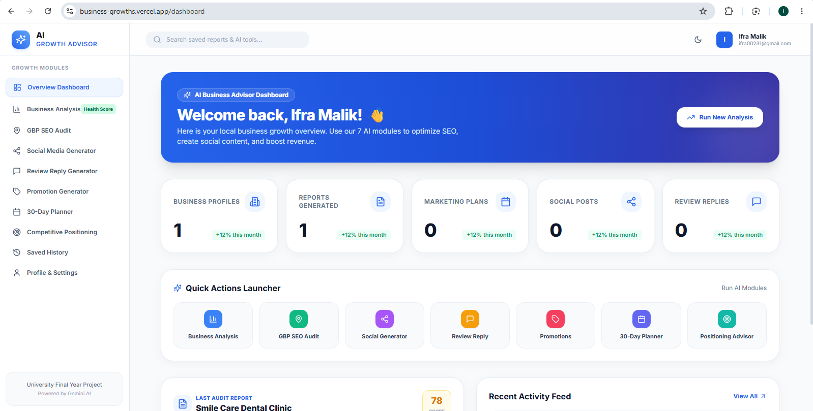
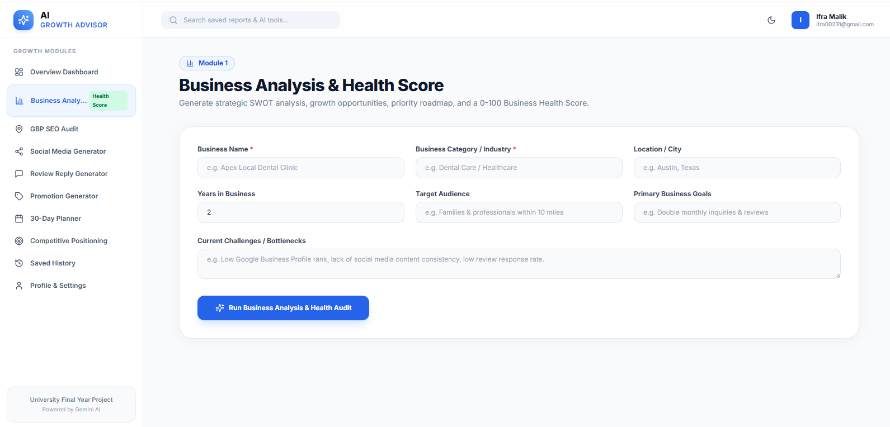
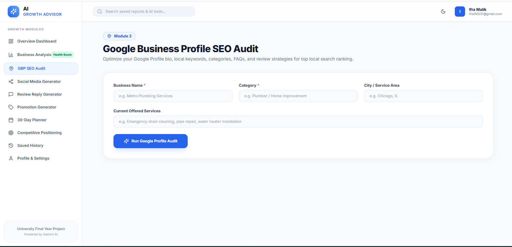
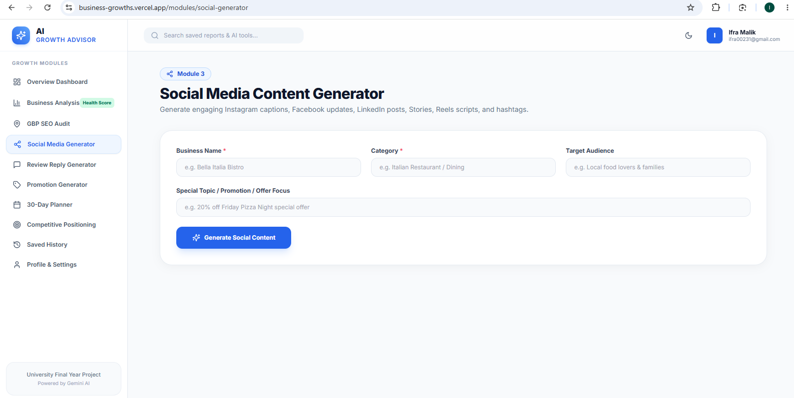
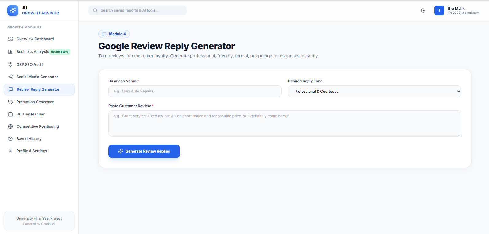
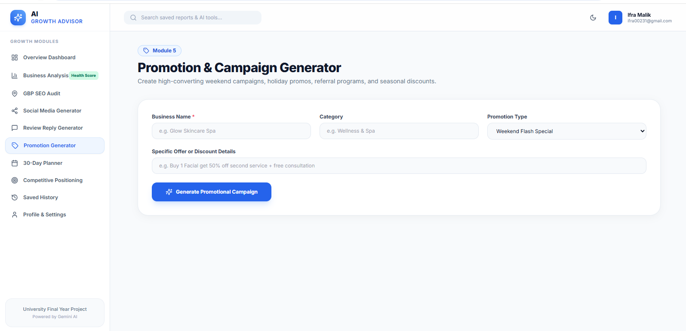
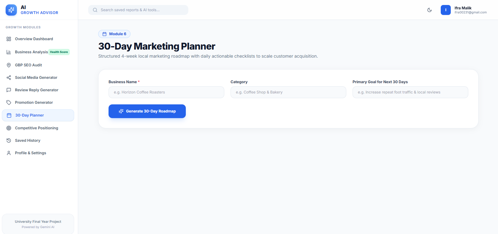
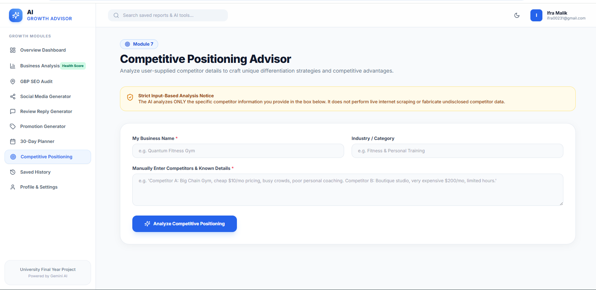
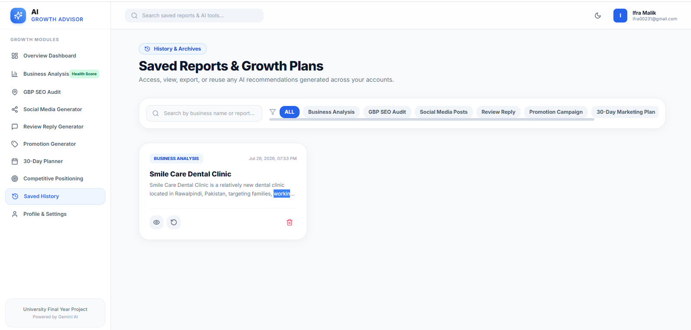
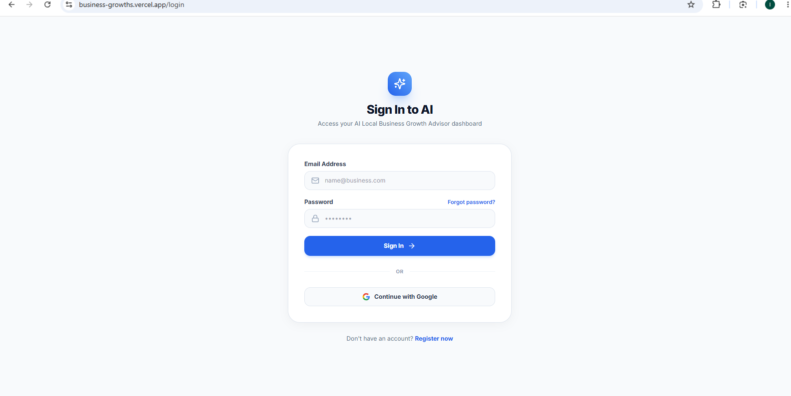

# AI Local Business Growth Advisor

 Production-Ready AI SaaS Application

---

## 📌 Project Overview & Problem Statement

Small local business owners often struggle with digital marketing, Google Business Profile (GBP) ranking, customer review management, and competitive positioning. Without a dedicated marketing team or budget for expensive agencies, local businesses miss out on high-intent customer traffic.

**AI Local Business Growth Advisor** is an intelligent, automated AI SaaS platform. It provides personalized local marketing strategies, Google SEO audits, 30-day growth roadmaps, social media posts, promotional campaigns, and custom review responses to help local businesses thrive.

---

## 🚀 Key Features & AI Modules

1. **Business Health Score (0-100)**: Evaluates SEO, GBP, social media presence, customer engagement, and growth potential with dynamic visual progress charts.
2. **7 Core AI Modules**:
   - 📊 **Module 1: Business Analysis & Health Score**: Comprehensive SWOT analysis, summary, and priority action plan.
   - 📍 **Module 2: Google Business Profile SEO Audit**: Optimized 750-character bio, local keywords, GBP categories, Q&A FAQs, and photo recommendations.
   - 📱 **Module 3: Social Media Content Generator**: Multi-platform Instagram captions, Facebook posts, LinkedIn updates, Story ideas, and Reel scripts.
   - 💬 **Module 4: Google Review Reply Generator**: Professional, friendly, formal, or apologetic customer review responses.
   - 🏷️ **Module 5: Promotion & Campaign Generator**: High-converting weekend flash offers, seasonal sales, loyalty campaigns, and CTA copy.
   - 📅 **Module 6: 30-Day Marketing Planner**: Interactive 4-week roadmap with daily habit checklists.
   - 🎯 **Module 7: Competitive Positioning Advisor**: Input-based strategic differentiation and unique value proposition guidance.
3. **Strict Backend-Only AI Architecture**: All Gemini API requests are routed securely via Express API endpoints. API keys are never exposed to the client.
4. **Professional PDF & TXT Export**: Formatted PDF exports with `jsPDF` and plain text `.txt` exports for offline sharing.
5. **Firebase Authentication & Persistence**: Email/Password & Google Sign-In with persistent Firestore report archiving and local fallback resilience.
6. **Modern Responsive UI**: Tailwind CSS design system with Dark Mode support, route lazy-loading, ARIA accessibility, and toast notifications.

---

## 🛠️ Technology Stack

- **Frontend**: React 18, TypeScript, Vite, Tailwind CSS, React Router v6, Lucide React Icons
- **Backend**: Node.js, Express.js, CORS, Express Rate Limit
- **AI Integration**: `@google/genai` (Google Gemini 2.5 Flash API via backend proxy)
- **Database & Auth**: Firebase Firestore & Firebase Authentication
- **Export Engine**: jsPDF

---

## 📐 System Architecture

```text
┌────────────────────────────────┐
│   Frontend (React / Vite)      │
└───────────────┬────────────────┘
                │ HTTP POST /api/ai/*
                ▼
┌────────────────────────────────┐
│   Backend (Node.js / Express)  │  ◄── Hidden API Keys (GEMINI_API_KEY)
└───────────────┬────────────────┘
                │ Google GenAI SDK
                ▼
┌────────────────────────────────┐
│   Google Gemini API            │
└────────────────────────────────┘
```

---

## 📂 Project Folder Structure

```text
AI-Business-Growth/
├── server/
│   ├── index.js                   # Central Express API entry point & Vercel serverless export
│   ├── middleware/
│   │   └── rateLimiter.js         # API rate limiting middleware
│   ├── routes/
│   │   └── aiRoutes.js            # Express API endpoints for 7 AI modules
│   └── services/
│       └── geminiService.js       # Secure Google Gemini SDK handler
├── src/
│   ├── components/
│   │   ├── charts/                # Business Health Score Visual Chart
│   │   ├── common/                # EmptyStates, Loading Skeletons
│   │   ├── dashboard/             # StatCards, QuickActions, RecentActivity
│   │   └── layout/                # Sidebar, TopNav, AppLayout, ProtectedRoute
│   ├── context/                   # AuthContext, ThemeContext, ToastContext
│   ├── pages/
│   │   ├── auth/                  # LoginPage, RegisterPage, ForgotPasswordPage
│   │   ├── dashboard/             # DashboardPage
│   │   ├── history/               # HistoryPage (Search, Filter, Export, Reuse)
│   │   ├── modules/               # All 7 AI module pages
│   │   └── profile/               # ProfilePage & Preferences
│   ├── services/                  # apiService.ts & firebaseService.ts
│   ├── types/                     # TypeScript Interfaces
│   ├── utils/                     # Prompt Builders & Export Utilities (PDF/TXT)
│   ├── App.tsx                    # React Lazy-Loaded Router
│   ├── main.tsx                   # React Root DOM Mount
│   └── index.css                  # Tailwind Base Directives & Global Styles
├── package.json
├── tailwind.config.js
├── tsconfig.json
├── vercel.json                    # Vercel Deployment Configuration
└── vite.config.ts                 # Vite Proxy & Build Setup
```

---

## ⚙️ Environment Variables Setup

### Backend Environment (.env)
Create a `.env` file in the root folder:
```env
PORT=5000
GEMINI_API_KEY=your_google_gemini_api_key_here
```

### Frontend Environment (.env.local)
Create a `.env.local` file in the root folder:
```env
VITE_FIREBASE_API_KEY=your_firebase_api_key
VITE_FIREBASE_AUTH_DOMAIN=your_firebase_project.firebaseapp.com
VITE_FIREBASE_PROJECT_ID=your_firebase_project_id
VITE_FIREBASE_STORAGE_BUCKET=your_firebase_project.appspot.com
VITE_FIREBASE_MESSAGING_SENDER_ID=your_messaging_sender_id
VITE_FIREBASE_APP_ID=your_firebase_app_id
VITE_API_BASE_URL=http://localhost:5000/api
```

---

## 💻 Local Installation & Setup

1. **Clone the repository**:
   ```bash
   git clone https://github.com/your-username/ai-business-advisor.git
   cd ai-business-advisor
   ```

2. **Install Dependencies**:
   ```bash
   npm install
   ```

3. **Run Concurrent Development Server**:
   ```bash
   npm run dev
   ```
   - Frontend will launch at: `http://localhost:5173`
   - Express Backend API will launch at: `http://localhost:5000`

---

## 🚀 Deployment Guide

### Deploying on Vercel
1. Push your repository to GitHub.
2. Import the project into Vercel.
3. Add environment variables in Vercel settings:
   - `GEMINI_API_KEY`
   - `VITE_FIREBASE_*` variables
   - `VITE_API_BASE_URL` (leave blank for Vercel relative serverless routing or point to your backend API URL).
4. Vercel automatically uses `vercel.json` to handle `/api/*` serverless routing and Vite static output (`dist`).

---


## 📸 Application Screenshots


### 🏠 Dashboard

Overview of all AI modules, recent activity, and Business Health Score.

<p align="center">
  
</p>

---

### 📊 Business Health Audit

Dynamic health score with pillar analysis, SWOT matrix, and growth recommendations.

<p align="center">
  
</p>

---

### 📍 Google Business Profile SEO Audit

AI-generated Google Business Profile optimization, local keywords, FAQs, and improvement suggestions.

<p align="center">
  
</p>

---

### 📱 Social Media Content Generator

Generate platform-specific captions, hashtags, stories, and reel ideas.

<p align="center">
  
</p>

---

### 💬 Google Review Reply Generator

Generate professional responses for positive, neutral, and negative customer reviews.

<p align="center">
  
</p>

---

### 🏷️ Promotion & Campaign Generator

Create seasonal promotions, flash sales, loyalty campaigns, and marketing copy.

<p align="center">
  
</p>

---

### 📅 30-Day Marketing Planner

Four-week AI-generated marketing roadmap with daily action items.

<p align="center">
  
</p>

---

### 🎯 Competitive Positioning Advisor

AI-generated competitor analysis, unique value proposition, and positioning strategy.

<p align="center">
  
</p>

---

### 📂 Report History

Saved reports with search, filtering, reuse, and export functionality.

<p align="center">
  
</p>

---


### 👤 Authentication

Firebase Login, Registration, and Google Sign-In.

<p align="center">
  
</p>


---

## 🔮 Future Enhancements & Roadmap

1. **Multi-Language Support**: Support AI recommendations in Spanish, French, and German.
2. **Automated GBP Post Scheduling**: Direct API connection to Google Business Profile for one-click publishing.
3. **Analytics Integration**: Google Analytics & Search Console keyword tracking dashboard.
